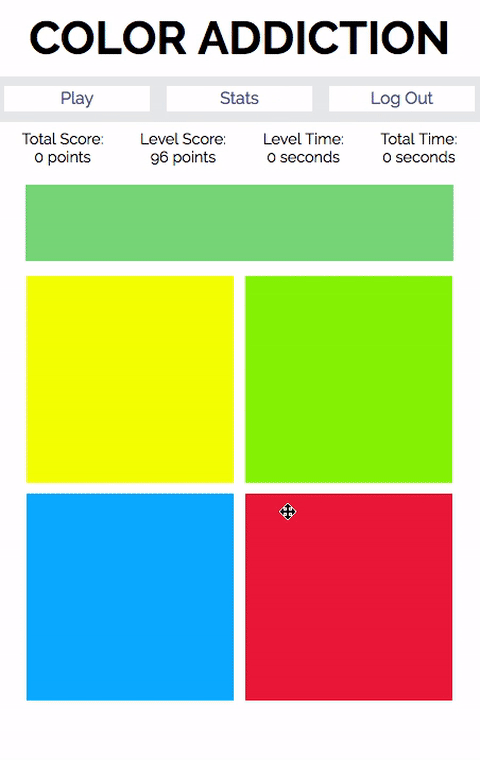
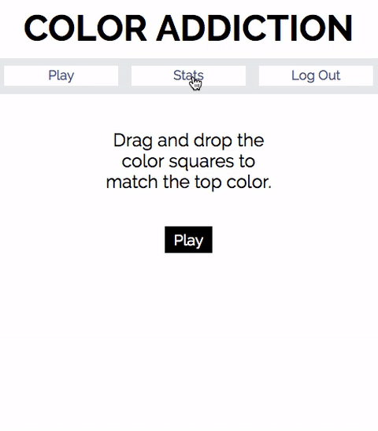
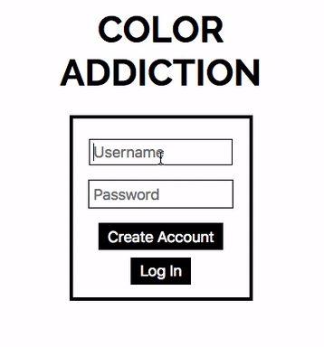

# Color Addiction
Most of the time, if an artist wants to experiment with color mixing, they have to buy supplies and physically mix colors. Color Addiction allows users to exercise their color blending skills in a fast-paced, fun, virtual environment. Users are challenged each level to drag and drop colored game peices that combine to match a given color for each level. Score is calculated based on the amount of tries you take and the amount of time it takes for you to reach the correct match. 

[Trello Board](https://trello.com/b/Ktjz0atK/color-addiction)

[Live Demo](http://ec2-18-191-148-7.us-east-2.compute.amazonaws.com/)



### Technologies Used
* HTML
* CSS
* JavaScript
* jQuery
* Node.js
* PostgreSQL
* Interact.js
* Color_mix.js

### Contributors
* Matheus Duarte
* Ian Gornall
* Sara Muntean

# Color Mixing
There are two main forms of color mixing: additive and subtractive. 

### Additive Mixing
Additive mixing is the way light blends on a screen, based on red, green, and blue light mixing (this is called RGB color). It is called "additive" because when many colors blend together it creates white.

### Subtractive Mixing
Subtractive mixing is the way pigment blends in a physical sense, based on cyan, magenta, yellow, and black mixing (this is called CMYK color). When all these colors are mixed together, they create black.

### Color Mixing and Our Game
For the purpose of our game, we decided to use subtractive mixing, as these are the color mixes that people are accustomed to seeing and therefore would be the most intuitive for our users. We used a [library](https://github.com/AndreasSoiron/Color_mixer) that took advantage of jQuery's color methods to blend our colors subtractively.

# Drag and Drop
The built-in HTML5 Drag and Drop API was unsuitable for this project because it creates a ghost image when elements are dragged.  The ghost image has built-in transparency, which would allow you to see the colors mixing before dropping them.

We decided to solve this problem by using a library.  We looked at several other libraries that were lacking in documentation and sample code, until we found one called [interact.js](http://interactjs.io/).  The library allows you to drag and drop objects directly, instead of by creating a ghost image.  It is well-documented with example code that was easy to follow. 

We ran into issues on mobile, even though their examples worked on their site.  Even directly copying and pasting their example resulted in an inability to drag the draggable elements more than a few pixels at a time.  The solution was to turn off a css attribute called touch-events on the draggable elements, as seen below:

```CSS
  -ms-touch-action: none;
  touch-action: none;
```

# Scoring and data


The scoring system takes advantage of built-in timers using setInterval and clearInterval.  When a level starts the setInterval method is called and stored in a variable.  When a level was finished, clearInterval had to be called on the stored variable.  This led to some bugs.  For example, our logout button caused a bug where the timers continued to run and the score glitched.  The solution was to call clearInterval whenever the game needed to be reset.

One big challenge was storing and retrieving data.  We set up a route on our express server to serve up each levels data.  In the route, the database query was made by level to retrieve user data, average data, and a leaderboard.  These queries sent through node are shown below
```Javascript
let userData = db.one(`SELECT score, level_time AS time FROM game WHERE user_id = ${req.user.id} AND level=${req.params.level} AND stage=${req.params.stage}`);
  let averageData = db.one(`SELECT ROUND(AVG(score), 2) as score, ROUND(AVG(level_time), 2) AS time FROM game WHERE level=${req.params.level} AND stage=${req.params.stage}`);
  let leaderData = db.query(`SELECT users.email, game.score, game.level_time AS time FROM game INNER JOIN users ON game.user_id=users.id WHERE level=${req.params.level} AND stage=${req.params.stage} ORDER BY score DESC LIMIT 3`);
```

# Login


Login was one of the more challenging features of our site. We wanted a user to only be able to see our gamepage if they were signed in and therefore authorized. To make sure a user was authorized, we used express routers in our server side code that had different middleware

We utilized a database for storing user information and also JSON Web Tokens to allow a user to stay signed in for a given amount of time. 

We utilized two routers, one for public access, which makes requests to the create user and login user functions, and an authorized router which has a validate token middelware. The authorized router routes are as follows:
```Javascript
authRouter.use(validateToken);

authRouter.get('/level_data/:id', getLevelData)
authRouter.get('/signedin',(req,res) => {
  res.send('is user');
});
authRouter.get('/game_data/:stage/:level', gameRoutes.getGameDataByLevel);
authRouter.post('/game_data', gameRoutes.postGameData);
```
As can be seen, before making requests to fetch any of the game data, it must pass through the validateToken middleware assigned to the authorized router.

# Deploying to AWS
We deployed to AWS.  The only issue we ran into was that our fetch requests broke.  We had to change our fetch requests to relative paths, because the absolute path to localhost would break on a user's remote machine.
